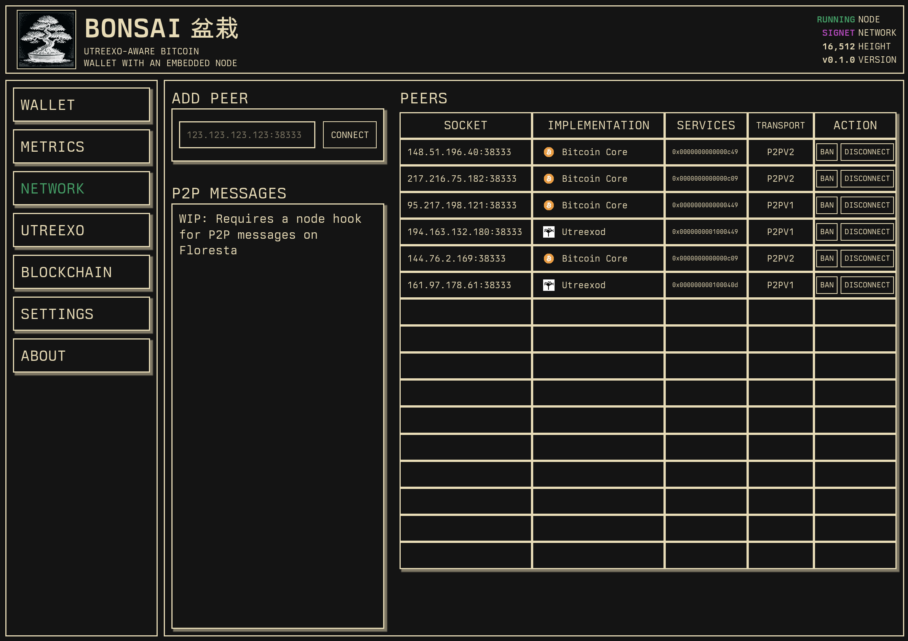
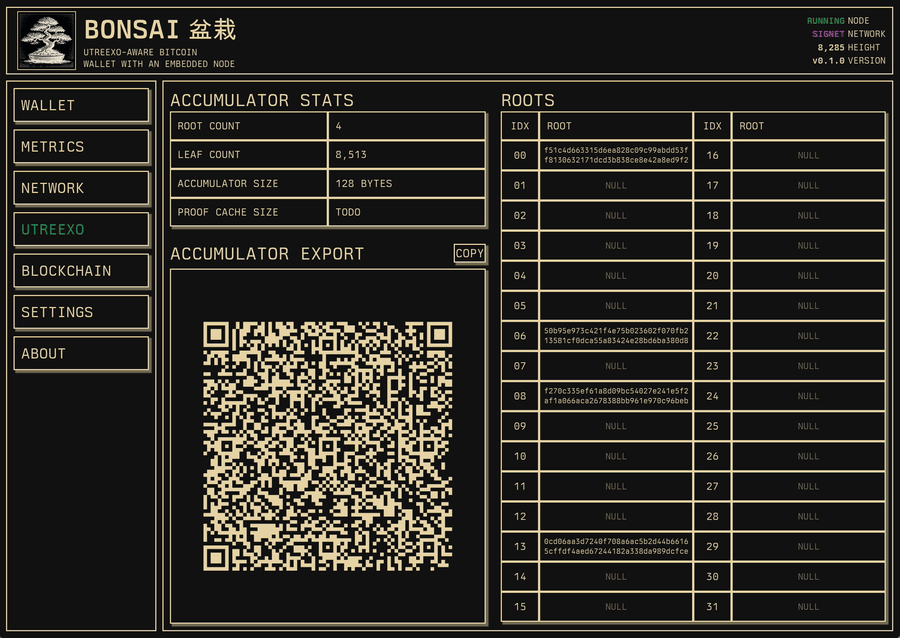
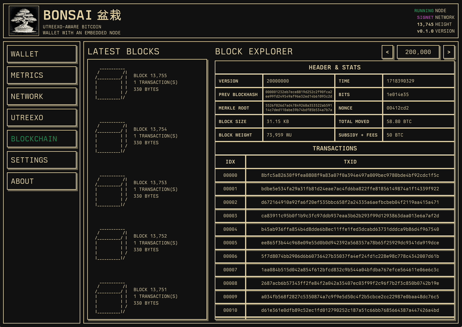
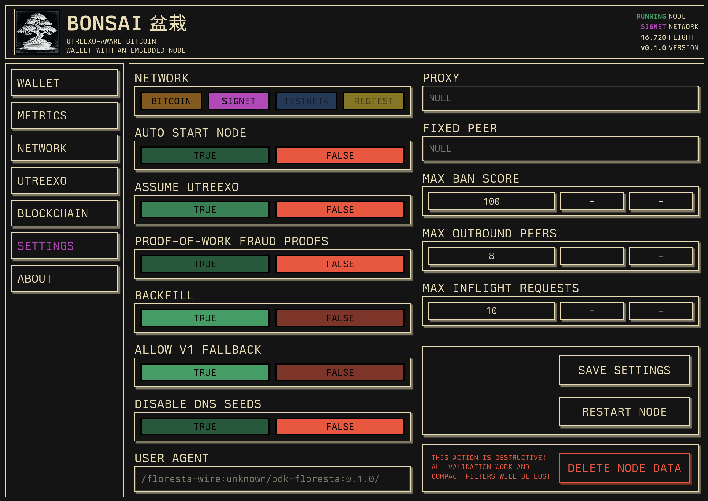
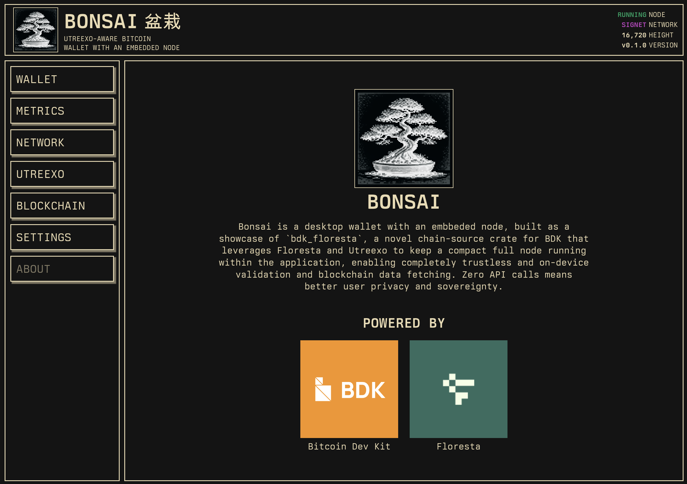

<div align="center">
  <h1>Bonsai 盆栽</h1>

  

  <p>
    <strong>A desktop bitcoin wallet with an embedded full node</strong>
    <br/>
    <strong>Powered by
      <a href="https://github.com/bitcoindevkit/bdk_wallet">BDK<a/>
      and
      <a href="https://github.com/getfloresta/Floresta">Floresta<a/>
    </strong>
  </p>
</div>

# About

Bonsai is built as a showcase of [`bdk_floresta`](https://github.com/luisschwab/bdk-floresta),
a novel chain-source crate for [`BDK`](https://github.com/bitcoindevkit/bdk_wallet), which embbeds
[`Floresta`](https://github.com/getfloresta/Floresta), an extremely lightweight full-node
implementation that leverages [`Utreexo`](https://eprint.iacr.org/2019/611.pdf) to keep a compact
representation of the UTXO set in under 2KB, and a small memory footprint. It allows wallet
synching with zero requests to untrusted third-party APIs. The vast majority of wallets rely
on third-party indexing servers (e.g. Esplora and Electrum protocols), which represent a huge privacy leak for users due to
IP address and Bitcoin address correlation. Removing this security hole is a must for sovereign
Bitcoin usage.

This application aims to show to developers the full set of capablities that
[`bdk_floresta`](https://github.com/luisschwab/bdk-floresta) allows for building wallet
applications with a nice and sleek user interface.

> [!NOTE]
> Bonsai, [`bdk_floresta`](https://github.com/luisschwab/bdk_floresta),
> and [`Floresta`](https://github.com/getfloresta/Floresta) are still a work in progress,
> meaning that functionality is limited. Bonsai will be updated accordingly.

# Running

This application is written in Rust. You need to have
[`cargo`](https://doc.rust-lang.org/stable/cargo/) installed.

[`just`](https://github.com/casey/just) is used as a convenience tool for command running,
installing it is advised.

```console
# List available commands
~$ just
bonsai
    build                     # Build `bonsai` [alias: b]
    check                     # Check code: formatting, compilation, and linting [alias: c]
    delete item="data-signet" # Delete files: data-signet, settings, target, lockfile [alias: d]
    fmt                       # Format code [alias: f]
    hot                       # Run with experimental hot-reloading (will crash if the node is active) [alias: h]
    run                       # Run the code [alias: r]
    run-release               # Run the code in release mode [alias: rr]

# Run the application in release mode
~$ just run-release
```

# Tabs

Bonsai has a few tabs that allow the user to monitor, configure and interact with the embedded node.

## Wallet

WIP

## Metrics

<div align="center">
  
</div>

In the **Metrics** tab, the user can `START`, `RESTART` and `STOP` the node, see node
metrics (such as node status, IBD progress, uptime, user agent and peer count), and monitor the
node's logs.

## Network

<div align="center">
  
</div>

In the **Network** tab, the user can see information about peers the node is connected to,
connect to new peer, disconnect or ban a peer, and see a dynamic diagram of the node's network
messages (WIP).

## Utreexo

In the **Utreexo** tab, the user can see statistics about the Utreexo accumulator,
such as leaf count, root count, accumulator and proof cache size, as well as a dynamic QR code
that allows exporting the node's validation. This can be scanned by other devices
so that they can start running at the same height as Bonsai without trust assumptions.

<div align="center">
  
</div>

## Blockchain

In the **Blockchain** tab, the user can see a live feed of validated blocks, as well as inspect any
block by fetching them from the P2P network.

<div align="center">
  
</div>

## Settings

In the **Settings** tab, the user can tweak the node's seetings as they please,
including switching the network, setting a custom user agent, SOCKS5 proxy,
fixed peer, and maximum number of outbound peers.

<div align="center">
  
</div>

## About

<div align="center">
  
</div>

# Acknowledgements
- [Utreexo](https://eprint.iacr.org/2019/611), for the novel UTXO set accumulator scheme that makes embedded nodes possible.
- [Floresta](https://github.com/getfloresta/Floresta), for the set of libraries which this application is built upon.
- [iced-rs](https://github.com/iced-rs/iced), for the GUI framework used to implement this.
- [US Graphics Company](https://usgraphics.com), for the beautiful [`Berkeley Mono`](https://usgraphics.com/products/berkeley-mono) font.
